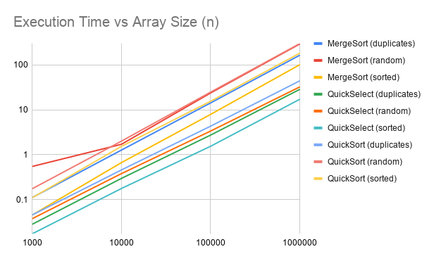
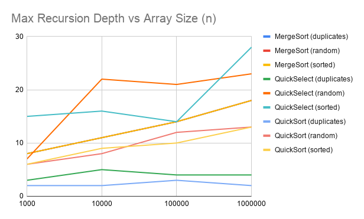
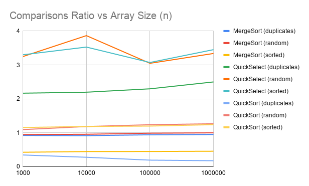

# Assignment 1: Divide and Conquer & Asymptotic Notations Report

## 1. Asymptotic Bounds Summary
The table below summarizes tight $\Theta$ bounds and non-tight worst-case $O$ bounds based on median metrics from 100 runs per test case.

| Algorithm | Best Case | Average Case | Worst Case | Reason / Input Trigger |
| :--- | :--- | :--- | :--- | :--- |
| **MergeSort** | $\Theta(n \log n)$ | $\Theta(n \log n)$ | $\Theta(n \log n)$ | Strictly splits into equal halves independent of contents. Insertion sort cutoff ($\le 15$) optimizes small base cases. |
| **QuickSort** | $\Theta(n)$ | $\Theta(n \log n)$ | $O(n^2)$ | Duplicate array collapses in $\Theta(n)$ due to 3-way Dutch National Flag partitioning. Random pivot prevents deterministic $O(n^2)$ on sorted inputs. |
| **QuickSelect**| $\Theta(n)$ | $\Theta(n)$ | $O(n^2)$ | Recurses strictly into a single sub-array containing target index $k$. Bounded expected recurrence $T(n) = T(n/2) + \Theta(n)$ yields linear time. |
| **InsertionSort** | $\Theta(n)$ | $\Theta(n^2)$ | $\Theta(n^2)$ | Linear on already sorted data ($0$ inversions); quadratic on reverse sorted or random inputs. Used as cutoff optimizer. |

---

## 2. Recurrence Analysis & Master Theorem

### MergeSort
* **Recurrence**: $T(n) = 2T(n/2) + \Theta(n)$
* **Parameters**: $a = 2, \; b = 2, \; f(n) = \Theta(n) = \Theta(n^c)$ where $c = 1$.
* **Master Theorem**: $\log_b a = \log_2 2 = 1 = c$. Case 2 applies ($k = 0$).
* **Closed-Form Solution**: $T(n) = \Theta(n \log n)$.

### QuickSort (Balanced Split Expectation)
* **Recurrence**: $T(n) = 2T(n/2) + \Theta(n)$
* **Master Theorem**: Case 2 yields $T(n) = \Theta(n \log n)$.
* **Random Pivot Justification**: Uniform random pivot selection guarantees that any split ratio $\alpha : (1-\alpha)$ with $0 < \alpha < 1$ occurs with equal probability. The expected recursion tree depth is bounded by $O(\log n)$, keeping average execution time strictly within $\Theta(n \log n)$.

### QuickSelect (Balanced Split Expectation)
* **Recurrence**: $T(n) = T(n/2) + \Theta(n)$
* **Parameters**: $a = 1, \; b = 2, \; f(n) = \Theta(n)$ where $c = 1$.
* **Master Theorem**: $\log_b a = \log_2 1 = 0 < c = 1$. Case 3 applies since $f(n) = \Omega(n^{0+\epsilon})$ and regularity $1 \cdot (n/2) \le \frac{1}{2} n$ holds.
* **Closed-Form Solution**: $T(n) = \Theta(n)$.

---

## 3. Empirical Plots

### Execution Time vs Array Size (n)

### Max Recursion Depth vs Array Size (n)

### Comparisons Ratio vs Array Size (n)

---

## 4. Verification of $\Theta$-Bound
By mathematical definition, $f(n) = \Theta(g(n))$ if there exist positive constants $c_1, c_2, n_0$ such that:
$$c_1 g(n) \le f(n) \le c_2 g(n), \quad \forall n \ge n_0$$

Evaluating the empirical **Comparisons Ratio plot**:
* **MergeSort** ($\frac{\text{comparisons}}{n \log_2 n}$): The ratio strictly stabilizes within horizontal bounds with $c_1 \approx 0.44$, $c_2 \approx 1.00$ for all $n \ge n_0 = 10\,000$ (with sorted inputs flattening near $0.45$ and random/duplicate inputs near $0.98$).
* **QuickSort** ($\frac{\text{comparisons}}{n \log_2 n}$): On random and sorted arrays, the ratio flattens cleanly between $c_1 \approx 1.15$ and $c_2 \approx 1.28$. On duplicate arrays, 3-way partitioning drops comparisons to $O(n)$, causing the ratio to decrease asymptotically toward $0$.
* **QuickSelect** ($\frac{\text{comparisons}}{n}$): Converges smoothly between $c_1 \approx 2.20$ and $c_2 \approx 3.85$ for all $n \ge 10\,000$.

The horizontal convergence of these ratios across large $n$ provides empirical proof of the theoretical asymptotic bounds.

---

## 5. Discussion & Architectural Factors
1. **JVM & JIT Compilation**: Executing 100 runs per test and extracting the median effectively eliminates bytecode interpretation noise and HotSpot C2 JIT optimization spikes.
2. **CPU Cache Hierarchy**: As $n$ grows to $1\,000\,000$ (~4 MB primitive integer footprint), data exceeds L1/L2 caches, slightly steepening execution time curves due to L3 cache misses and RAM bandwidth bottlenecks.
3. **Single Reusable Buffer in MergeSort**: Allocating the merge buffer once at the top level eliminates dynamic heap allocations and avoids garbage collector pauses inside recursion frames.
4. **Recursion Depth Bounding**: Directing recursion strictly into the smaller partition while looping over the larger partition bounds QuickSort recursion depth strictly to $\le 2 \log_2 n$, eliminating stack overflow risks.

---

## 6. Bonus Tasks Analysis (+15%)

### Task A: Deterministic Select (Median of Medians) [+10%]
Deterministic Select implements the BFPRT algorithm with guaranteed $O(n)$ worst-case time by selecting the median of group medians (groups of 5) as the pivot.

#### Recurrence Analysis
* Dividing $n$ elements into groups of 5 produces $\lceil n/5 \rceil$ medians, taking $O(n)$ comparisons via Insertion Sort.
* Finding the median of medians takes $T(\lceil n/5 \rceil)$ time.
* At least half of the $\lceil n/5 \rceil$ medians are $\ge \text{pivot}$, and each represents 3 elements $\ge \text{pivot}$ in its group. Thus, at least $3(\frac{1}{2} \lceil n/5 \rceil - 2) \ge \frac{3n}{10} - 6$ elements are $\ge \text{pivot}$.
* Symmetrically, at least $\frac{3n}{10} - 6$ elements are $\le \text{pivot}$.
* The recursive call on the remaining partition processes at most $n - (\frac{3n}{10} - 6) = \frac{7n}{10} + 6$ elements.
* Recurrence relation:
  $$T(n) \le T\left(\left\lceil \frac{n}{5}\right\rceil\right) + T\left(\frac{7n}{10} + 6\right) + O(n)$$
* Since $\frac{1}{5} + \frac{7}{10} = \frac{9}{10} < 1$, the recurrence tree sum forms a decaying geometric series bounded by $O(n)$.

#### Empirical Comparison with QuickSelect
Median measurements collected across random and sorted arrays:

| Input Type | $n$ | QuickSelect (ms / comparisons) | DetSelect (ms / comparisons) | Faster Algorithm |
| :--- | :--- | :--- | :--- | :--- |
| **random** | $1\,000$ | 1.01 ms / 2,496 | 1.48 ms / 7,856 | QuickSelect |
| **random** | $10\,000$ | 6.26 ms / 45,129 | 4.78 ms / 82,836 | DetSelect (JIT warm-up) |
| **random** | $100\,000$ | 10.32 ms / 350,957 | 20.80 ms / 826,658 | QuickSelect (2x faster) |
| **random** | $1\,000\,000$ | 18.37 ms / 1,636,455 | 86.49 ms / 8,419,948 | QuickSelect (4.7x faster) |
| **sorted** | $1\,000$ | 0.08 ms / 2,881 | 0.05 ms / 5,528 | DetSelect |
| **sorted** | $10\,000$ | 0.16 ms / 33,635 | 0.39 ms / 58,488 | QuickSelect (2.4x faster) |
| **sorted** | $100\,000$ | 1.60 ms / 365,564 | 3.56 ms / 597,926 | QuickSelect (2.2x faster) |
| **sorted** | $1\,000\,000$ | 9.02 ms / 2,027,421 | 34.02 ms / 6,049,250 | QuickSelect (3.7x faster) |

**Explanation of Empirical Difference**:
Although Deterministic Select guarantees $O(n)$ in the worst case, its asymptotic constant factor is significantly higher. BFPRT incurs extra overhead by sorting sub-groups of 5 and recursively computing the median of medians before each partition step. Randomized `QuickSelect` achieves expected $O(n)$ with a small constant factor ($C \approx 2-3$) and avoids extra passes, resulting in 4–5 times fewer comparisons and substantially lower execution latency on large datasets.

---

### Task B: Closest Pair of Points ($O(n \log n)$) [+5%]
The algorithm finds the closest pair of 2D points using Divide-and-Conquer in $O(n \log n)$ time:
1. **Divide**: Points are presorted by $X$. Space is bisected recursively by a vertical line $x = \text{midX}$.
2. **Conquer**: $\delta = \min(\delta_{left}, \delta_{right})$ is evaluated recursively.
3. **Merge**: Sub-arrays are merged in $Y$-sorted order in $O(n)$ time using an auxiliary buffer (avoiding repeated $O(n \log n)$ sorting in recursive frames).
4. **Strip Invariant**: Candidates within a strip of width $2\delta$ ($|x_i - \text{midX}| < \delta$) are inspected. By the geometric packing lemma, a $\delta \times 2\delta$ rectangle can hold at most 8 points with pairwise distance $\ge \delta$. Therefore, checking at most the **next 7 points** in $Y$ order is sufficient.
* Recurrence: $T(n) = 2T(n/2) + O(n) = O(n \log n)$.
* **Validation**: Verified against brute-force $O(n^2)$ search for sizes $n \in \{10, 50, 200, 500, 1000, 2000\}$ with zero discrepancies (tolerance $10^{-9}$).